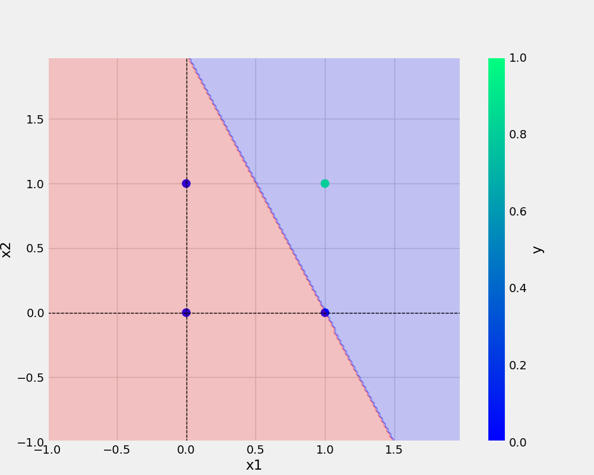
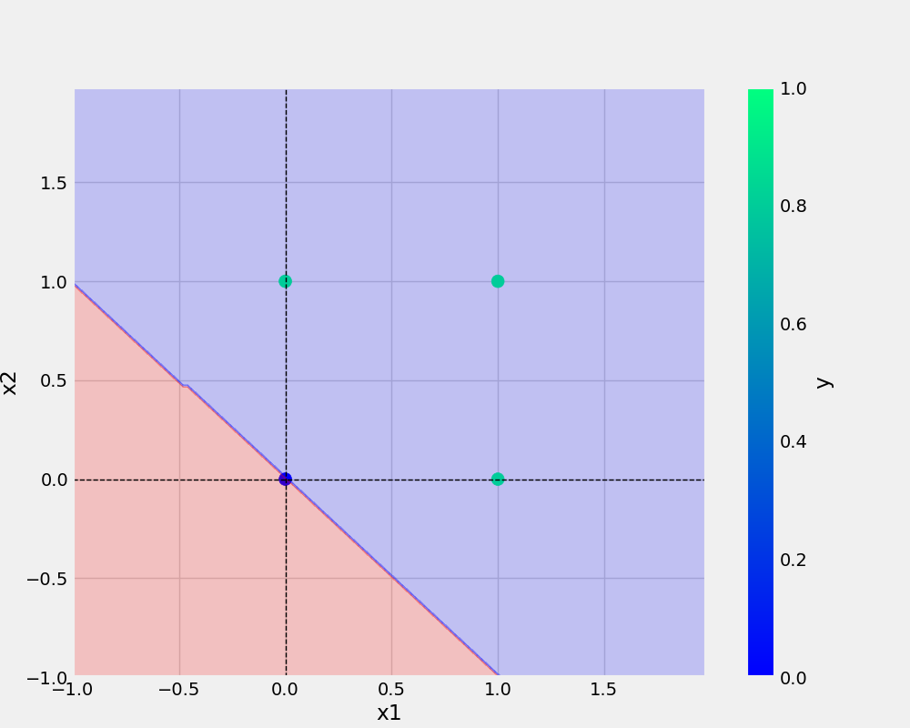

# OneNeuron
OneNeuron|Perceptron 

# Commands Used

```bash
git add . && git commit -m "docstring updated" && git push origin main
```

```bash
cp Research \Notebook/demo.ipynb .
```

## Add URL:- 
[Git handbook](https://guides.github.com/introduction/git-handbook/)
<a href="https://www.w3schools.com">Visit W3Schools.com!</a

## Add Image:- 



# Python Code:-

```python
def main(data,eta,epochs,filename,plotFileName):
   

    df = pd.DataFrame(data)

    print(df)
    X,y = prepare_data(df)

    model = Perceptron(eta, epochs)
    model.fit(X, y)

    _ = model.total_loss()

    save_model(model,filename)
    save_plot(df,plotFileName,model)
```


